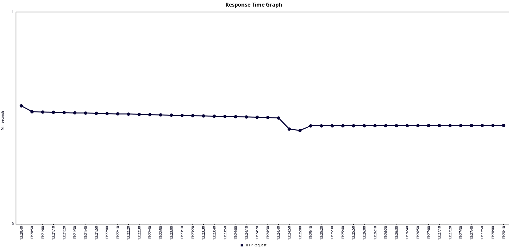
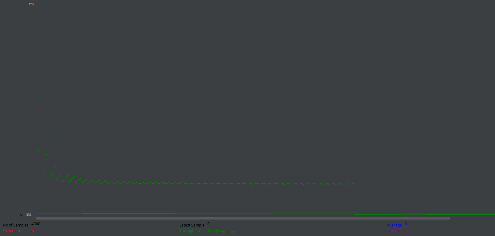

# Lesson 14 Exercise 1

This section documents exercise 1 from lesson 14

---

### Website performance testing

In this exercise I have to prepare a simple website with 3 pages for JMeter test scenario.

### Homework exercise requirements

Create JMeter test plan:

* Thread Group: 50 Users
* Ramp-Up Period: 10 seconds
* Loop Count: 5

Results analysis:
* average response time
* throughput (requests/sec)
* % of errors
* impact on hardware resources

Documentation - `this file`
* Test specification
* results charts
* bottleneck analysis
* optimization recommendations

### Test specification

This test will show us the average response time, troughput and errors (if anything occurs).

### Test results

#### View Results in Table

##### Average Response Time
The average response time (ms) on each request takes up from `0 to 1/ms` to complete, only at the beginning there is `23/ms`.Every `20-30` requests I see response time hit ups to `2/ms`, every 200-300 I noticed spikes to `3/ms`.

##### Throughput
Graph Results - Throughput is `92.015/m` on average.
Summary Report - Throughput is `101.9/s` on average.

##### % of Errors
`0%` - Status in every single one request is market as correct and completed, there was no errors.

#### Response Time Graph

Response time is average under 0.5/ms, we can see a spike on the beginning of a test because program just started process, and we can also see a small spike down on the middle when the processes from the beginning executed sucessfouly.

#### Graph Result

Same as Response Time Graph, at the beginning we can see throughput spike because of a test starting, then we can see the througput is average under 0.2/ms, the throughput is 92.015/m on GUI version of JMeter, it could be much faster but we are using GUI version of JMeter instead of CLI.

#### Impact on Hardware Resources
I didnt saw anything, maybe my machine is just too much powerfoul for basic tests.

#### Bottleneck Analysis
There are few spikes as I said before every 200-300 requests there is request that is going for `3/ms` its actually 300% more than average response time with simple request, maybe its a sign of creating load-balancer that will divide those requests before that numbers request in bulk.

#### Optimization  recommendations
Creating load-balancer that will divide requests before hitting certain request numbers to cool down the machine.