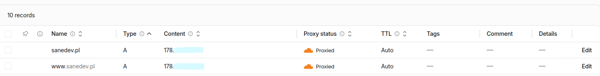

# Lesson 15 

This section documents exercises from lesson 15

---


### Exercise 1: Implementation of the Let's Encrypt on real server

#### Exercise requirements:

* Server access
* Registered domain
* Configure HTTP server with basic site
* Use Certbot to gain Let's Encrypt certificate
* Configure auto renewal for certificate
* Check SSL security using online tools like SSL Labs Server Test

#### Additional points

* Configure HSTS (HTTP Strict Transport Security)
* Configure OCSP Stapling
* Configure TLS 1.3 as preffered protocol
* SSL Labs degree should be A or A+

### Before homework

I actually have own website `www.sanedev.pl` so instead of doing every taks I will check if im already using them because I know that I used some of the provided exercise requirements.


#### Server access

I do have access to my own server by ssh and by Raspberry Pi Connect.

```bash
sicin@pi-server:~ $ uname -a && whoami
Linux pi-server 6.xx.xxxxx-rpi-xxxx
sicin
sicin@pi-server:~ $ curl ifconfig.me
178.xx.xxx.xx
```

#### Registered domain



#### Configure HTTP server with basic site

Currently I'm using nginx server

```bash
sicin@pi-server:~ $ nginx -version
nginx version: nginx/1.26.3
```

#### Let's Encrypt Certbot certificate

```bash
sicin@pi-server:~ $ sudo certbot certificates
Saving debug log to [REDACTED]

- - - - - - - - - - - - - - - - - - - - - - - - - - - - - - - - - - - - - - - -
Found the following certs:
  Certificate Name: sanedev.pl
    Serial Number: [REDACTED]
    Key Type: [REDACTED]
    Domains: sanedev.pl www.sanedev.pl
    Expiry Date: [REDACTED] (VALID: 37 days)
    Certificate Path: [REDACTED]
    Private Key Path: [REDACTED]
- - - - - - - - - - - - - - - - - - - - - - - - - - - - - - - - - - - - - - - -
```

#### Certbot auto renewal

My auto renewal service is running.

```bash
sicin@pi-server:~ $ systemctl list-timers | grep certbot
Sat 2026-07-04 22:10:55 CEST       6h Sat 2026-07-04 08:56:52 CEST      6h ago certbot.timer                certbot.service
```

and it runs cron script

```bash
sicin@pi-server:~ $ ls -l /etc/cron.d/certbot
-rw-r--r-- 1 root root 802 Apr 16  2023 /etc/cron.d/certbot
```

---

### Exercise 2: mTLS implementation for API


#### Exercise requirements:

* Create own CA (Certificate Authority) using OpenSSL.
* Generate server certificate and sign it with own CA.
* Generate client certificate and also sign it with own CA.
* Configure HTTP server (Apache/Nginx) to request a client certificate.
* Create script or use curl for connection testing with client certificate.
* Prepare documentation `this file` describing implementation and explaining the benefits of mTLS.


##### Creating CA

To create CA I used openssl command:

```bash
openssl genrsa -out ca/ca.key 4096
```

this command generate `rsa` key, `4096` bits is a very strong password

##### Creating CA certificate

To create CA certificate I used command:

```bash
openssl req -new -x509 -days 3650 -key ca/ca.key -out ca/ca.crt
```

its a public document that says "there is someone named sanedev, and here its his public key"

`-x509` it means that certificate is self signed, it has to start from somewhere.

`-days 3650` 10 years of validity


##### Server certificate

to generate is I also used openssl command:

```bash
openssl genrsa -out server/server.key 2048
```

its a private serwer key, but only `2048` bits (AI told me that is enough for server).

Now im generating CSR (Certificate Signing Request) - its an application for certificate.
It includes public server key and data (CN=localhost). and we send it to CA to sign it with command:

```bash
openssl x509 -req -days 365 -in server/server.csr -CA ca/ca.crt -CAkey ca/ca.key -CAcreateserial -out server/server.crt
```

CA signs CSR and issues certificate for server, now server has "passport" that is signed with my CA.

`-CAcreateserial` creates ca.srl file that tracks serial numbers of issued certificates.

##### Client crtificate

Same steps like for server, CSR key, signing with CA, only diffrence is instead `CN=localhost` we use `CN=client`


```bash
sane@power-sane:~/ssl-lab$ ls -la ca/ server/ client/
ca/:
total 20
drwxrwxr-x 2 sane sane 4096 Jul  5 01:09 .
drwxrwxr-x 5 sane sane 4096 Jul  5 01:01 ..
-rw-rw-r-- 1 sane sane 2183 Jul  5 01:05 ca.crt
-rw------- 1 sane sane 3272 Jul  5 01:01 ca.key
-rw-rw-r-- 1 sane sane   41 Jul  5 01:11 ca.srl

client/:
total 20
drwxrwxr-x 2 sane sane 4096 Jul  5 01:11 .
drwxrwxr-x 5 sane sane 4096 Jul  5 01:01 ..
-rw-rw-r-- 1 sane sane 1692 Jul  5 01:11 client.crt
-rw-rw-r-- 1 sane sane 1123 Jul  5 01:11 client.csr
-rw------- 1 sane sane 1704 Jul  5 01:10 client.key

server/:
total 20
drwxrwxr-x 2 sane sane 4096 Jul  5 01:09 .
drwxrwxr-x 5 sane sane 4096 Jul  5 01:01 ..
-rw-rw-r-- 1 sane sane 1655 Jul  5 01:09 server.crt
-rw-rw-r-- 1 sane sane 1086 Jul  5 01:08 server.csr
-rw------- 1 sane sane 1704 Jul  5 01:06 server.key
```

##### Nginx configuration

To configure nginx server I used this configuration:

```bash
server {
    listen 443 ssl;
    server_name localhost;

    ssl_certificate /home/sane/ssl-lab/server/server.crt;
    ssl_certificate_key /home/sane/ssl-lab/server/server.key;
    ssl_client_certificate /home/sane/ssl-lab/ca/ca.crt;
    ssl_verify_client on;

    root /var/www/test_app;
    index index.html;
}
```
##### Curl test

and the test output from curl is:

```bash
sane@power-sane:~/ssl-lab$ curl --cacert ~/ssl-lab/ca/ca.crt \
>      --cert ~/ssl-lab/client/client.crt \
>      --key ~/ssl-lab/client/client.key \
>      https://localhost
<html>
<head><title>Test App</title></head>
<body>
<h1>Test Application</h1>
<p>This is a simple test page for load testing.</p>
<ul>
<li><a href="/page1.html">Page 1</a></li>
<li><a href="/page2.html">Page 2</a></li>
<li><a href="/page3.html">Page 3</a></li>
</ul>
</body>
</html>
```


##### Benefits of mTLS

The first thing that I noticed when learning about mTLS is that we can secure our microservices such as API's that can connect to each other demanding certificates to work and actually respond to the requests.

For me its most importat thing, it's just the good layer of security between services and clients or other people that could try to use our services against us or benefit from them.