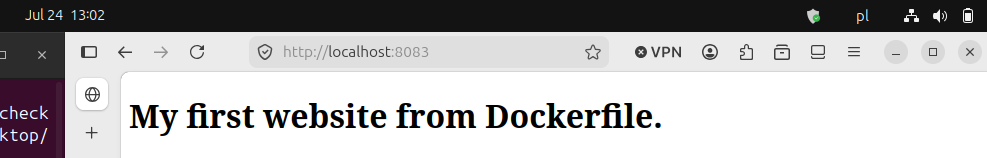

```bash
sane@power-sane:~/first-devops-project/docs/Lesson-20/docker-nginx-site$ docker images
                                                                                                                                     i Info →   U  In Use
IMAGE                ID             DISK USAGE   CONTENT SIZE   EXTRA
my-nginx-docker:v1   d5281f5d81f1        238MB         63.1MB
nginx:latest         5a88c9c45479        241MB           66MB
postgres:latest      3a82e1f56c8f        650MB          168MB
ubuntu:latest        3131b4cc82a7        161MB         45.3MB
```

```bash
sane@power-sane:~/first-devops-project/docs/Lesson-20/docker-nginx-site$ docker build -t my-nginx-docker:v1 .
[+] Building 0.5s (7/7) FINISHED                                                                                                          docker:default
 => [internal] load build definition from Dockerfile                                                                                                0.0s
 => => transferring dockerfile: 97B                                                                                                                 0.0s
 => [internal] load metadata for docker.io/library/nginx:latest                                                                                     0.0s
 => [internal] load .dockerignore                                                                                                                   0.0s
 => => transferring context: 2B                                                                                                                     0.0s
 => [internal] load build context                                                                                                                   0.0s
 => => transferring context: 32B                                                                                                                    0.0s
 => [1/2] FROM docker.io/library/nginx:latest@sha256:5a88c9c45479443d7be2eadc894b4ed0a9801bae03d97a5760ae13b5c2005942                               0.0s
 => => resolve docker.io/library/nginx:latest@sha256:5a88c9c45479443d7be2eadc894b4ed0a9801bae03d97a5760ae13b5c2005942                               0.0s
 => CACHED [2/2] COPY index.html /usr/share/nginx/html/index.html                                                                                   0.0s
 => exporting to image                                                                                                                              0.2s
 => => exporting layers                                                                                                                             0.0s
 => => exporting manifest sha256:37cd1eeb65906a2414d489dbb03c6c4ada1b2a7b00e9ed1224838f8625086595                                                   0.0s
 => => exporting config sha256:ecb9f2ecd5492a892e6b7b1d57aaf4b7bba10a5c9e75e080449beff0bda1895c                                                     0.0s
 => => exporting attestation manifest sha256:7f88e2868268083047a176ce62f771d8eaaff722b39ce37514a1f1af880cdc36                                       0.0s
 => => exporting manifest list sha256:5ddee2eaea72e45dc9b066692f720b1f3b3d3c41421633d01c1afd47e7326fb7                                              0.0s
 => => naming to docker.io/library/my-nginx-docker:v1                                                                                               0.0s
 => => unpacking to docker.io/library/my-nginx-docker:v1                                                                                                                                       </html>
```

```bash
sane@power-sane:~/first-devops-project/docs/Lesson-20/docker-nginx-site$ docker run -d \
> --name moja-strona \
> -p 8083:80 \
> my-nginx-docker:v1
0a9fdc128f2e1c4e0749e97c78c75aa9e4bd24296bf6f063dfe23e4c08ef009e
```

```bash
sane@power-sane:~/first-devops-project/docs/Lesson-20/docker-nginx-site$ docker ps
CONTAINER ID   IMAGE                COMMAND                  CREATED         STATUS         PORTS                                     NAMES
0a9fdc128f2e   my-nginx-docker:v1   "/docker-entrypoint.…"   4 seconds ago   Up 4 seconds   0.0.0.0:8083->80/tcp, [::]:8083->80/tcp   moja-strona
```

```bash
sane@power-sane:~/first-devops-project/docs/Lesson-20/docker-nginx-site$ curl localhost:8083
<!DOCTYPE html>
<html>
<head>
    <title>My Docker website.</title>
</head>
<body>
    <h1>My first website from Dockerfile.</h1>
    <p>Nginx runs from own Docker image.</p>
</body>
</html>
```

