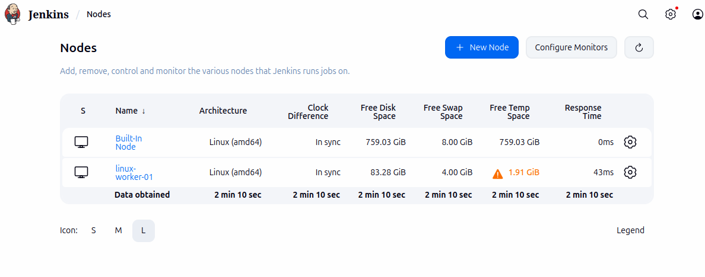
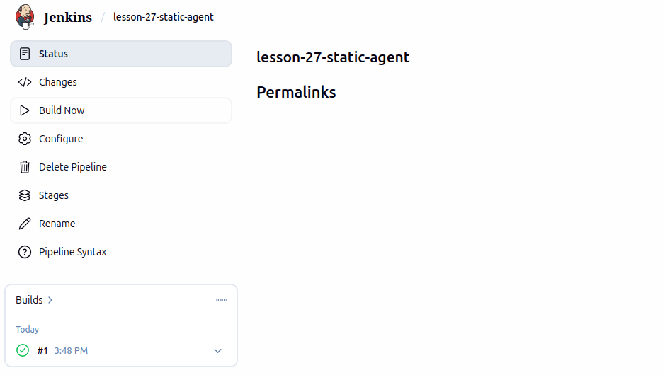

# Lesson 27 — Jenkins Static Agent

## Homework: Static Agent Configuration

The goal of this exercise is to configure a static Jenkins agent on a separate Debian virtual machine and execute a test Pipeline on that agent.

## Architecture

```text
Jenkins Controller
    |
    | SSH
    |
    v
Debian 13 VM
    |
    +-- Java 21.0.12
    +-- Jenkins user
    +-- Label: linux-worker-01
    +-- NODE_ENV=production
```

## Agent Configuration

The Jenkins agent is configured as a permanent static agent.

```bash
Parameter	Value
Agent name	linux-worker-01
Operating system	Debian 13
Java	OpenJDK 21.0.12
Launch method	SSH
Remote root directory	/home/jenkins
Label	linux-worker-01
Environment variable	NODE_ENV=production
SSH port	22
```
SSH Connection

The Jenkins Controller runs inside a Docker container on the development machine.

The Jenkins Controller connects to the Debian VM using SSH:

```bash
Jenkins Controller
        |
        | SSH
        v
Debian VM
```
The SSH connection uses the dedicated jenkins user.

Pipeline

The Pipeline is defined in Jenkinsfile.

The Pipeline explicitly selects the static agent using:

```bash
agent {
    label 'linux-worker-01'
}
```
The Pipeline performs the following checks:

Displays Linux system information using uname -a.
Displays memory information using free -m.
Displays the NODE_ENV environment variable.
Verifies that NODE_ENV is set to production.
Reports the final Pipeline status.
Expected Result

A successful Pipeline execution should show:

```bash
NODE_ENV=production
NODE_ENV is correctly configured as production.
Agent test completed successfully.
Pipeline execution finished.
```

The uname -a output should identify the Debian VM, confirming that the Pipeline was executed on the configured Jenkins agent rather than on the Controller.

Project Structure

```bash
Lesson-27/
├── Jenkinsfile
├── README.md
└── jenkins_home/
    └── .gitignore
```

Result

The static Jenkins agent was successfully configured and connected to the Jenkins Controller through SSH.

The agent can now execute Jenkins Pipeline jobs using the linux-worker-01 label.


```bash
Started by user sane
[Pipeline] Start of Pipeline
[Pipeline] node
Running on linux-worker-01 in /home/jenkins/workspace/lesson-27-static-agent
[Pipeline] {
[Pipeline] stage
[Pipeline] { (System Information)
[Pipeline] sh
+ uname -a
Linux Deb 6.12.95+deb13-amd64 #1 SMP PREEMPT_DYNAMIC Debian 6.12.95-1 (2026-07-04) x86_64 GNU/Linux
[Pipeline] sh
+ free -m
               total        used        free      shared  buff/cache   available
Mem:            3921        1356         728           9        2096        2565
Swap:           4092           0        4092
[Pipeline] }
[Pipeline] // stage
[Pipeline] stage
[Pipeline] { (Environment Check)
[Pipeline] sh
+ echo NODE_ENV=production
NODE_ENV=production
+ [ production = production ]
+ echo NODE_ENV is correctly configured as production.
NODE_ENV is correctly configured as production.
[Pipeline] }
[Pipeline] // stage
[Pipeline] stage
[Pipeline] { (Declarative: Post Actions)
[Pipeline] echo
Pipeline execution finished.
[Pipeline] echo
Agent test completed successfully.
[Pipeline] }
[Pipeline] // stage
[Pipeline] }
[Pipeline] // node
[Pipeline] End of Pipeline
Finished: SUCCESS
```


