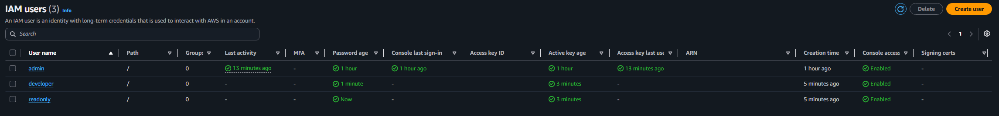
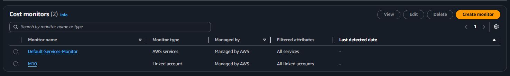
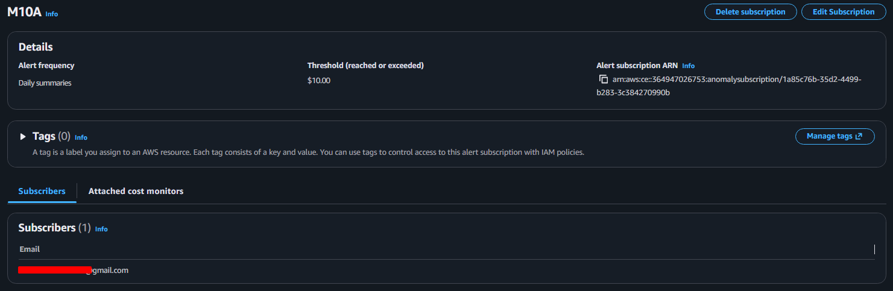
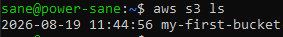
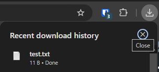

## Lesson 28 Exercises

---

### Exercise 1


#### Organization structure

Created admin, developer, readonly IAM users with configured IAM groups 




#### Motniroing and alerts

Created custom monitoring alert named 'M10A" with limit of 10$ it also sends alert emails.






### Exercise 2


Created S3 bucket




Added file for test and downloaded it throught amazon website




List available AMI

```bash
sane@power-sane:~$ aws ec2 describe-images \                                                                            >   --filters \                                                                                                         >     "Name=name,Values=amzn2-ami-hvm-*" \                                                                              >     "Name=owner-id,Values=137112412989" \                                                                             >   --query 'Images[*].[ImageId,Name,Architecture,CreationDate]' \                                                      >   --output table                                                                                                      ------------------------------------------------------------------------------------------------------------            |                                              DescribeImages                                              |            +-----------------------+-------------------------------------------+---------+----------------------------+            |  ami-001f5a2b717e6b52e|  amzn2-ami-hvm-2.0.20260707.0-x86_64-gp2  |  x86_64 |  2026-07-02T21:47:29.000Z  |            |  ami-0a905b99668efea4b|  amzn2-ami-hvm-2.0.20260710.0-x86_64-gp2  |  x86_64 |  2026-07-10T05:02:03.000Z  |            |  ami-0accfd8c0f73e10be|  amzn2-ami-hvm-2.0.20260710.0-x86_64-ebs  |  x86_64 |  2026-07-10T05:10:40.000Z  |            |  ami-000e4e62211f137f0|  amzn2-ami-hvm-2.0.20260707.0-arm64-gp2   |  arm64  |  2026-07-02T21:47:29.000Z  |            |  ami-09ff78ad403e67ce4|  amzn2-ami-hvm-2.0.20260608.0-x86_64-gp2  |  x86_64 |  2026-06-04T17:19:00.000Z  |            |  ami-00c0d07ba9bf2cf17|  amzn2-ami-hvm-2.0.20260615.0-x86_64-ebs  |  x86_64 |  2026-06-11T21:26:42.000Z  |            |  ami-08a3652a718399504|  amzn2-ami-hvm-2.0.20260608.0-x86_64-ebs  |  x86_64 |  2026-06-04T17:25:35.000Z  |            |  ami-04fb00e1538ce80e3|  amzn2-ami-hvm-2.0.20260803.1-x86_64-gp2  |  x86_64 |  2026-08-03T17:42:18.000Z  |            |  ami-0f38e4c6b228846b1|  amzn2-ami-hvm-2.0.20260615.0-x86_64-gp2  |  x86_64 |  2026-06-11T21:19:06.000Z  |            |  ami-034b9edbe17fee16e|  amzn2-ami-hvm-2.0.20260727.0-arm64-gp2   |  arm64  |  2026-07-25T00:03:15.000Z  |            |  ami-0f2bdc5f75d956a8d|  amzn2-ami-hvm-2.0.20260629.0-x86_64-ebs  |  x86_64 |  2026-06-26T20:47:11.000Z  |            |  ami-0190ed100c3882b54|  amzn2-ami-hvm-2.0.20260707.0-x86_64-ebs  |  x86_64 |  2026-07-02T21:55:04.000Z  |            |  ami-0ac2194148e1c5092|  amzn2-ami-hvm-2.0.20260720.0-arm64-gp2   |  arm64  |  2026-07-15T16:44:16.000Z  |            |  ami-0bb57b83aff458f02|  amzn2-ami-hvm-2.0.20260817.0-arm64-gp2   |  arm64  |  2026-08-12T23:51:05.000Z  |            |  ami-09b3205628ce4f9c9|  amzn2-ami-hvm-2.0.20260817.0-x86_64-ebs  |  x86_64 |  2026-08-12T23:52:37.000Z  |            |  ami-04cdff5053254feee|  amzn2-ami-hvm-2.0.20260817.0-x86_64-gp2  |  x86_64 |  2026-08-12T23:51:05.000Z  |            |  ami-04a936ae029bb8e50|  amzn2-ami-hvm-2.0.20260615.0-arm64-gp2   |  arm64  |  2026-06-11T21:19:06.000Z  |            |  ami-08e7b703cc44137ae|  amzn2-ami-hvm-2.0.20260629.0-x86_64-gp2  |  x86_64 |  2026-06-26T20:40:36.000Z  |            |  ami-083e6264d05106987|  amzn2-ami-hvm-2.0.20260622.1-x86_64-ebs  |  x86_64 |  2026-06-19T16:27:53.000Z  |            |  ami-0ba57d257ed0e038e|  amzn2-ami-hvm-2.0.20260803.1-arm64-gp2   |  arm64  |  2026-08-03T17:42:18.000Z  |            |  ami-094eb18f56857c967|  amzn2-ami-hvm-2.0.20260803.1-x86_64-ebs  |  x86_64 |  2026-08-03T17:43:50.000Z  |            |  ami-0327cd3b40aab5d5c|  amzn2-ami-hvm-2.0.20260622.1-arm64-gp2   |  arm64  |  2026-06-19T16:21:19.000Z  |            |  ami-0c7bdac0d13287a5c|  amzn2-ami-hvm-2.0.20260727.0-x86_64-gp2  |  x86_64 |  2026-07-25T00:03:15.000Z  |            |  ami-0198036cc37bd6837|  amzn2-ami-hvm-2.0.20260720.0-x86_64-gp2  |  x86_64 |  2026-07-15T16:44:16.000Z  |            |  ami-07a16c2d14591744a|  amzn2-ami-hvm-2.0.20260720.0-x86_64-ebs  |  x86_64 |  2026-07-15T16:52:52.000Z  |            |  ami-085ac56e40e979a4d|  amzn2-ami-hvm-2.0.20260727.0-x86_64-ebs  |  x86_64 |  2026-07-25T00:09:50.000Z  |
```


List security-group

```bash
sane@power-sane:~$ aws ec2 describe-security-groups \                                                                   >   --query 'SecurityGroups[*].GroupName' \                                                                             >   --output table                                                                                                      ------------------------                                                                                                |DescribeSecurityGroups|                                                                                                +----------------------+                                                                                                |  default             |                                                                                                +----------------------+ 
```

List IAM users

```bash
sane@power-sane:~$ aws iam list-users \                                                                                 >   --query 'Users[*].UserName' \                                                                                       >   --output table                                                                                                      ---------------                                                                                                         |  ListUsers  |                                                                                                         +-------------+                                                                                                         |  admin      |                                                                                                         |  developer  |                                                                                                         |  readonly   |                                                                                                         +-------------+   
```

List any AWS service 

```bash
sane@power-sane:~$ aws s3 ls s3://my-first-bucket-1787132692/                                                           2026-08-19 11:45:55         11 test.txt  
```